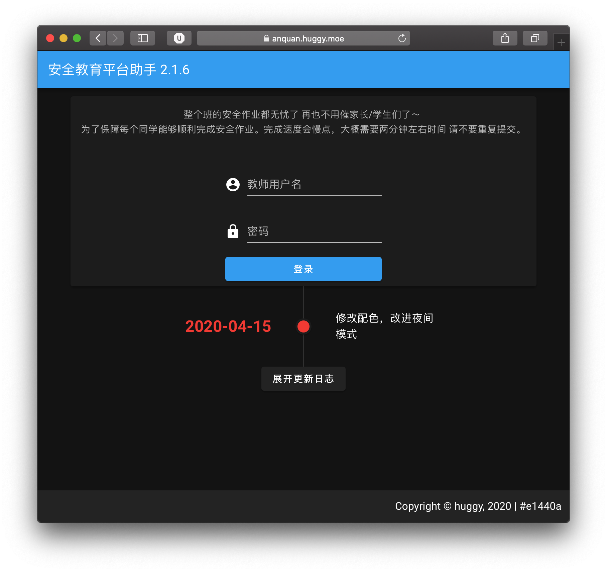

# 安全教育平台助手前端

## [Demo](https://anquan.huggy.moe)

使用 [vuetifyjs](https://vuetifyjs.com) 构成的简易前端

# 特点
- 支持自动完成手机端登录任务
- 支持自动完成每学期已授课的作业以及专题作业
- 支持自动重置学生密码为123456
- 支持地区专题作业的完成
- 支持了 PWA 可以在 Chrome 以 app 形式打开
- **`快`**

# 待完成 （以下都是无限期拖延 TODOLIST）
- 点击登录即可自动完成（不需要选中未完成的作业）
- ~~后端争取改好开源~~
- 安全提醒

服务端包括了一些我个人抓取的 安全教育平台客户端私有api 而且代码而且写得很烂 暂时不适合开源

研究登录之类的可以看我之前的 [gist](https://gist.github.com/xiao201261/e623f93b7bcb93dddcf24cef6f0713ad) 要寻找无地区限制的登录请抓客户端api

网站的图标需要灵感，欢迎大家的来稿

## 生成版本号
用于判断更新 GIT_COMMIT_HASH 在本地构建的时候乱填就行

    node genbuild.json.js GIT_COMMIT_HASH

## 调试
    yarn serve

## 打包

    yarn build
    
# Licence
MIT
